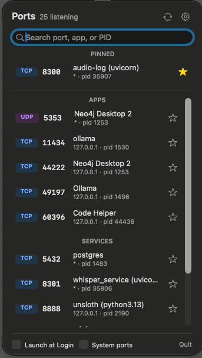

# PortShow

A macOS menu bar app that shows every port in use on your Mac, which app or service owns it, and lets you open, reveal, or kill it in one click.



## Features

- **Menu bar popover** listing listening TCP ports and bound UDP ports, refreshed every 3 seconds.
- **Grouped automatically** by where the owning program lives:
  - **Pinned**: ports you've starred, always at the top.
  - **Apps**: ports opened by desktop apps (anything inside a `.app` bundle).
  - **Services**: things you run yourself, such as dev servers, Homebrew databases and scripts.
  - **System**: macOS daemons and app-managed helpers (under `/System`, `/usr`, `~/Library`, …). Hidden unless **System ports** is ticked.
- **Meaningful names** for scripts. A Python/Node/Java process is named after its project folder and what it runs, e.g. `audio-log (uvicorn)` instead of `Python`.
- **Hover a row** for quick actions:
  - Open `http://host:port` in your browser
  - Copy the port, process and PID
  - Show the start script in Finder (e.g. `app/main.py` for `uvicorn app.main:app`, or the program itself for native binaries)
  - Kill the process (SIGTERM)
- **Right-click a row** for the full menu: Open in Browser, Copy Port, Copy PID, Reveal in Finder, Pin/Unpin, Kill Process.
- **Search** by port, name, PID, or address.
- **Launch at Login** checkbox (installs a per-user LaunchAgent).
- **Notifications** when a pinned port goes up or down. Toggle them with the gear icon.

## Requirements

- macOS 13 Ventura or later
- Apple Silicon (the build currently targets `arm64` only)
- Xcode Command Line Tools to build (`xcode-select --install`). Full Xcode isn't needed.

## Build

```sh
./build.sh
```

This compiles the sources with `swiftc`, assembles and ad-hoc signs `build/PortShow.app`, and packages `build/PortShow.dmg`.

## Install

1. Open `build/PortShow.dmg` and drag **PortShow** into **Applications**.
2. The app isn't notarized, so the first time you open it, right-click it in Applications, choose **Open**, then confirm.
3. Look for the network icon in the menu bar.

## Limitations

- Ports are read with `lsof` as your user, so sockets owned by root-only daemons may not appear, and **Kill** can't stop processes owned by other users.
- Grouping is a heuristic based on the executable's location; pin anything that lands in the wrong section.

## Project layout

| Path | Purpose |
|---|---|
| `Sources/main.swift` | App delegate, menu bar item and popover |
| `Sources/PopoverViewController.swift` | Popover UI: header, search, sections, footer |
| `Sources/PortRowView.swift` | A single port row, hover actions and context menu |
| `Sources/PortScanner.swift` | `lsof` parsing, naming, categorisation, start-file lookup, kill |
| `Sources/AppState.swift` | Refresh loop, search, sections, settings |
| `Sources/FavoritesStore.swift` | Pinned ports (UserDefaults) |
| `Sources/LoginItemManager.swift` | Launch-at-login LaunchAgent |
| `Sources/NotificationManager.swift` | Pinned port up/down notifications |
| `build.sh`, `make_icon.sh` | Build, icon generation, DMG packaging |
